  

    

  # Ayush Kumar

 

  

  ### 🚀 Full-Stack Developer &mdash; MERN &amp; AI

  **Full-Stack Developer • Product Builder • AI Enthusiast**

   

  
  &nbsp;
  
  &nbsp;
  
  &nbsp;
  

---

### 👨‍💻 About Me

I'm a **Full-Stack Developer** at Xcelore Pvt Ltd who cares about shipping products end-to-end — from schema to UI to production monitoring.

* 💼 **Currently:** Building and owning production platforms — KYC onboarding for **Muthoot Finance (MreKYC)** and the **HR.Vaidik** HR platform, used daily by 18+ professionals.
* ⚡ **Performance-obsessed:** Migrated UI libraries, upgraded frameworks, and optimized API calls for a **60% reduction** in page load time.
* 🧠 **Building in public:** Creator of **[Docorio](https://docorio.app)** (100+ users, 40+ document tools) and **[Alpha UI](https://alphaui.dev)** (80+ components, adopted by 500+ teams).
* 🏆 **Competitive builder:** SIH 2023 National Finalist, 2nd place at Hack The November (180+ teams), 400+ problems solved on LeetCode &amp; GFG.
* 🤝 **Mentor:** Guided 5+ junior developers on Git workflows, architecture, and code review practices.

---

### 📡 Technical Capability &amp; Skills Radar

  

---

### 🛠️ Core Tooling &amp; Technologies

| **Category** | **Technologies** |
| :--- | :--- |
| **Application Development** |  |
| **AI &amp; Python** |  |
| **Data &amp; Infra** |  |
| **Tools &amp; Platforms** |  |

---

### 📈 Activity &amp; Contribution Flow

  

---

### ⚡ Engineering Showcase &amp; Performance

  

---

### 🎓 Education &amp; Achievements

* 🎓 **B.Tech, Information Technology** — Abes Institute of Technology (2020–2024), CGPA 8.15/10
* 🏅 **SIH 2023** — Smart India Hackathon National Finalist
* 🥈 **Hack The November** — 2nd place among 180+ teams
* 📊 **400+** problems solved on LeetCode &amp; GeeksforGeeks · CodeChef rank 726/14,000+

---

### 🎮 The Human Side

I'm not just a code machine. When the IDE closes, here is who I am:

* 🤖 **Philosophy:** I believe in shipping fast, measuring impact (like that 60% load-time cut), and mentoring the next person up.
* ☕ **Fuel:** Chai, changelogs, and a genuine love for clean git history.

---

  Let's build something incredible together.

